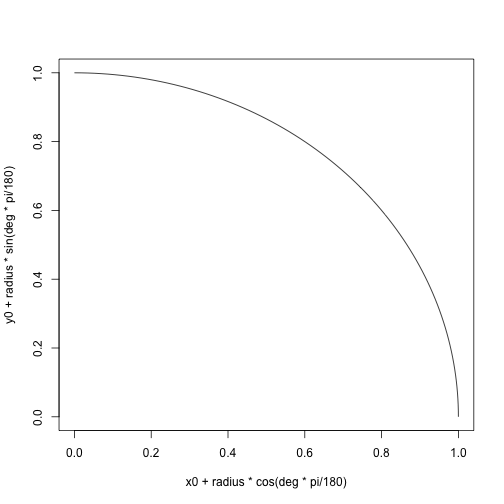
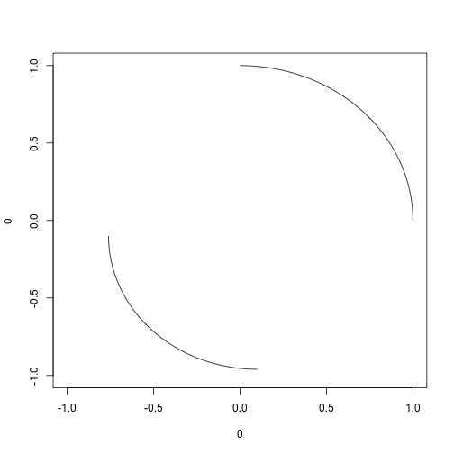
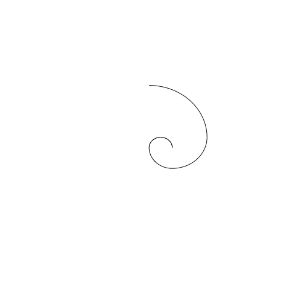
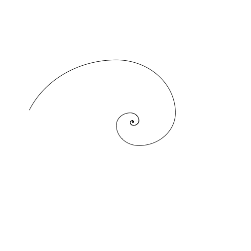
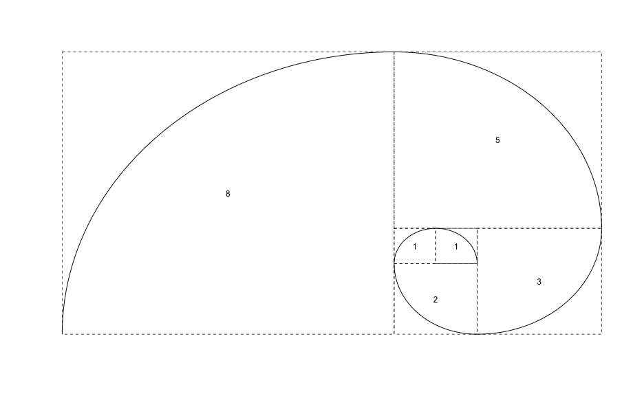
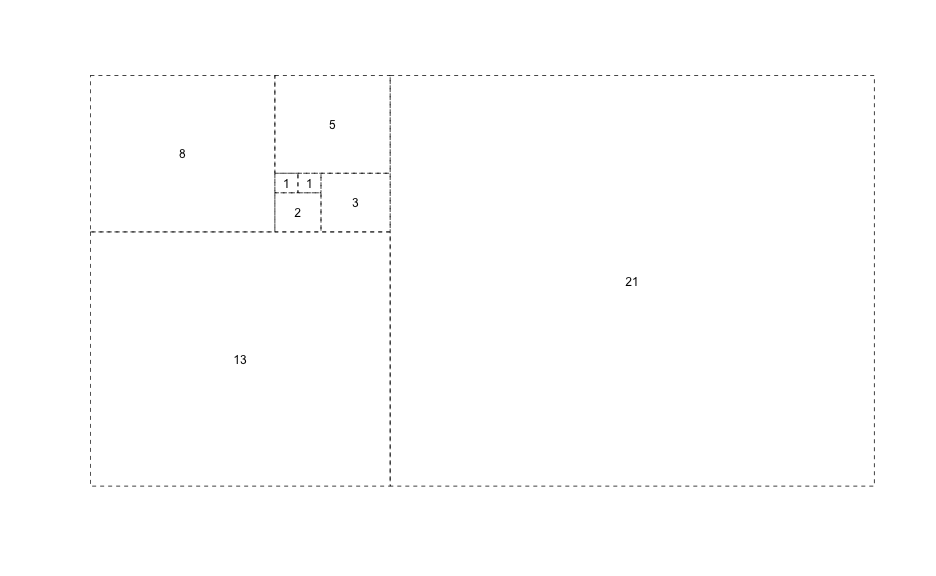

# 황금비율나선 그리기

- 이윤석
- 2020년 6월 16일

## 황금비율 나선 


## 거칠게 그려 보기
### 원호 그리기 기초

원을 그리기 위해 필요한 좌표는 원점의 위치와 반지름으로부터 얻는다. 고교수학을 동원해서 theta가 0도에서 360도일 때(라디안으로는 0에서 $2\pi$) 모든 (x, y)는 $x = r * cos(\theta)$이고 $y = r * sin(\theta)$의 조합이다. 각도를 촘촘하게 할수록 정밀하게 그려지지만 1도 간격으로도 어색하지 않다. 원점을 (0, 0)으로 해서 반지름 1로 정하고 각도를 0도에서 90도로만 제한하면 제1사분면에 원호를 그린다.


```r
> x0 <- 0
> y0 <- 0
> deg <- 0:90
> radius <- 1
> plot(x0 + radius * cos(deg * pi / 180), y0 + radius * sin(deg * pi / 180), type = "l")
```




###

황금비율나선은 유한한 n개의 $\pi/2$ 원호의 연속이다. 하나의 원호가 끝나는 지점에서 반지름을 달리하는 원호가 시계반대방향으로 접해서 연결된다. 황금비율나선의 첫 아홉 개 원호의 반지름을 R벡터로 묘사하면 정의에 따라 이렇게 된다. 우리에게 익숙한 피보나치 수열에서 0을 제외하고 시작한다.


```r
> radius <- c(1, 1, 2, 3, 5, 8, 13, 21, 34)
```
제1사분면에서 2, 3, 4로 그려 나갈 것이므로 이렇게 묘사할 수 있다.


```r
> rep(1:4, length = 9)
```

```
## [1] 1 2 3 4 1 2 3 4 1
```

그려질 사분면에 따른 각도의 시작점은 $(quadrant - 1) * 90$이고  끝지점은 $quadrant * 90$이므로 각도를 1도 간격으로 쓰면 이렇다. 콜론 연산자는 우선순위가 곱셈보다 높으므로 주위에 괄호를 열고 닫아야 한다.


```r
> quadrant <- 1 # 1, 2, 3, 4
> (deg <- ((quadrant - 1) * 90) : (quadrant * 90))
```

```
##  [1]  0  1  2  3  4  5  6  7  8  9 10 11 12 13 14 15 16
## [18] 17 18 19 20 21 22 23 24 25 26 27 28 29 30 31 32 33
## [35] 34 35 36 37 38 39 40 41 42 43 44 45 46 47 48 49 50
## [52] 51 52 53 54 55 56 57 58 59 60 61 62 63 64 65 66 67
## [69] 68 69 70 71 72 73 74 75 76 77 78 79 80 81 82 83 84
## [86] 85 86 87 88 89 90
```

이렇게 쓰면 0, 90, 180, 270, 360은 전후의 사분면에 모두 포함되는 문제가 생기지만 그림을 그릴 땐 양쪽 모두에서 그려지는 게 오히려 자연스러울 것이므로 고치지 않겠다. 여기까지 검토한 내용을 정리해 보면 이렇게 된다. x0, y0에 원호의 원점 좌표를 넣고 r에는 반지름을 넣고 그릴 사분면을 quadrant에 넣고 실행한다.


```r
> d <- ((quadrant - 1) * 90):(quadrant * 90)
> rad <- d * pi / 180
> lines(x0 + r * cos (rad), y0 + r * sin (rad))
```
한 plot 위로 여러 개의 plot 요소를 중첩해서 그릴 예정이어서 plot 함수가 아니라 lines 함수를 써서 원호를 그렸다. 선행하는 plot이 없으면 lines 함수 단독으로는 그림이 그려지지 않는다. 이 코드가 제대로 작동하는지 궁금하면 다음처럼 테스트 하면 된다.


```r
> plot(0, 0, type = "n")
> # one arc in the quadrant 1
> x0 <- 0; y0 <- 0; r <- 1
> quadrant <- 1
> d <- ((quadrant - 1) * 90):(quadrant * 90)
> rad <- d * pi / 180
> lines(x0 + r * cos (rad), y0 + r * sin (rad)) #
> # another arc in the quadrant 3
> x0 <- 0.1; y0 <- -0.1; r <- 0.86
> quadrant <- 3
> d <- ((quadrant - 1) * 90):(quadrant * 90)
> rad <- d * pi / 180
> lines(x0 + r * cos (rad), y0 + r * sin (rad)) #
```


위의 코드는 뻔히 반복하는 연산의 집합체이므로  별개의 함수로 만들어 두는 것이 좋겠다. 코드 안에서 `lwd = 1.3`은 원호의 굵기를 1.3배 증강하는 인수이다.


```r
> arc <- function(x0, y0, r = 1, quadrant) {
+ 	# draw an arc 
+ 	# 	with origin = (x0, y0) and radius = r
+ 	# at the given quadrant (1, 2, 3, 4)
+ 	# ** A plot must be pre-declared. **
+ 	#
+ 	d <- ((quadrant - 1) * 90):(quadrant * 90)
+ 	rad <- d * pi / 180
+ 	lines(x0 + r * cos (rad), y0 + r * sin (rad), lwd = 1.3)
+ } #-- end of function #arc#
```

### n번째 원호의 반지름

첫 원호가 반지름 1로 시작해서 두 번째 원호도 반지름 1, 이후로 2, 3, 5, 8, ... 로 나아가는 것이 규칙이다. 즉, 앞에서 다루었던 피보나치 수열의 n + 1번째 값이 n번째 원호의 반지름이 된다. 첫 10개의 원호의 반지름을 출력했다. (함수 `fibonacci`는 이미 선언되었다고 간주한다.)


```r
> # radius of 1~10 arcs
> N <- 1:10
> ( r <- sapply(N, function ( x ) fibonacci (x + 1) ) )
```

```
##  [1]  1  1  2  3  5  8 13 21 34 55
```


### n번째 원호의 원점

첫 번째 원호가 (0, 0)에서 시작해서 시계반대방향으로 회전할 때 n번째 원호의 좌표를 구하는 방법은 일견 어지럽지만 조금만 들여다보면 규칙이 보인다. 먼저, 첫 두 원호는 정의에 따라 원점이 (0, 0)이다. 따라서 세 번째 원호부터가 문제이다. 세 번째 원호가 3사분면에 그려질 때 원점의 세로좌표는 변하지 않고 가로좌표는 $+1\times r$ 이동한다. 네 번째 원호의 원점에서는 가로좌표 움직임 없이 세로좌표만 $+2\times r$ 이동한다. 다섯 번째 원호는 가로좌표만 $-3\times r$ 이동... 이와 같은 회전이 거듭되는 꼴이다.

 첫 10개 가운데 첫 두 개의 원호를 제외한 8개의 움직임 중에서 움직임의 폭이 아닌 방향만을  R로 코드화 하면 자연스럽게 다음처럼 된다.  $2\times 8$ 행렬을 만들어서 윗 열에는 가로좌표 이동 방향으로, 아래 열에는 세로좌표의 이동 방향을 배당한다.


```r
> n <- 10
> move <- rbind(
+ 	rep ( c( +1, 0, -1, 0), length = n - 2),
+ 	rep ( c(0, +1, 0, -1), length = n - 2 ) 
+ 	)
> rownames(move) <- c("x", "y")
> move
```

```
##   [,1] [,2] [,3] [,4] [,5] [,6] [,7] [,8]
## x    1    0   -1    0    1    0   -1    0
## y    0    1    0   -1    0    1    0   -1
```

좌표가 이동하는 폭은 가로 세로 공히 n - 1번째 피보나치 숫자가 된다. 가령 다섯 번째 원호를 그릴 때 원점의 이동폭은 다음처럼 구한다.


```r
> n <- 5
> x0 <- x0 + fibonacci (n - 1) * move["x", n - 2]
> y0 <- y0 + fibonacci (n - 1) * move["y", n - 2]
```

여기서 얻은 값은 절대 좌표가 아니라 바로 전 원호의 원점으로부터의 이동폭이다. 

### 원호 다섯 개 그리기

여기까지 얻은 코드로 원호를 다섯 개 그렸다. 먼저 빈 plot을 하나 생성한다. plot의 크기는 막연하게 여섯 번째 피보나치 값인 8보다 훨씬 큰 값으로 잡아 보았다.


```r
> plot(c(-10, 10), c(-10, 10), type = "n",
+ 	axes = FALSE,
+ 	xlab = "", ylab = "")
```


아무 일도 일어나지 않은 것처럼 보인다. 빈 플롯 위에 첫 두 원호를 정의대로 그린다.


```r
> x0 <- y0 <- 0
> r <- 1 # Redundant code
> # 1st
> i <- 1
> arc(x0, y0, r = fibonacci(i + 1), quadrant = 1)
> # 2nd
> i <- 2
> arc(x0, y0, r = fibonacci(i + 1), quadrant = 2)
```

이어서 3번 원호를 그린다.


```r
> # 3th
> i <- 3
> x0 <- x0 + move["x", i - 2] * fibonacci(i - 1)
> y0 <- y0 + move["y", i - 2] * fibonacci(i - 1)
> arc(x0, y0, r = fibonacci(i + 1), quadrant = 3)
```

같은 방식으로 4, 5번째 원호를 그린다. 사분면을 지정하는 방식에 패턴을 가미했다. i번째 원호가 그려질 사분면은 i를 4로 나눈 나머지를 사분면 번호로 취하되, 4로 나누어 똑떨어지면 4사분면에 그린다. `quadrant = ifelse(i %% 4, i %% 4, 4)` 부분에서 성취하는 값이다.


```r
> # 4th, 5th
> for (i in 4:5) {
+ 	x0 <- x0 + move["x", i - 2] * fibonacci(i - 1)
+ 	y0 <- y0 + move["y", i - 2] * fibonacci(i - 1)
+ 	arc(x0, y0, r = fibonacci(i + 1), quadrant = ifelse(i %% 4, i %% 4, 4) )
+ }
```



### 함수로 만들기

여기까지 만들어진 코드를 정리하면 반복 타자를 줄일 겸 함수의 형태로 만들 수 있다. R 기초 함수만으로 구현하는 것이 목표이다. `golden_spiral`의 0.5판으로 이름을 붙이고 인수 n에 원호의 개수를 넣은 채 호출하면 된다.


```r
> golden_spiral <- function ( n ) {
+ 	# version 0.5	
+ 	#-- header	
+ 	max <- fibonacci(n + 1)
+ 	move <- rbind(
+ 		rep(c(+1, 0, -1, 0), length = n - 2),
+ 		rep(c(0, +1, 0, -1), length = n - 2)
+ 		)
+ 	rownames(move) <- c("x", "y")
+ 	#
+ 	#-- initialization for an empty plot
+ 	plot(c(-max, max), c(-max, max), type = "n",
+ 		axes = FALSE,
+ 		xlab = "", ylab = "")
+ 	#
+ 	#-- body
+ 	x0 <- y0 <- 0 
+ 	r <- 1 # Redundant code!
+ 	# n = 1
+ 	arc(x0, y0, r = fibonacci(2), quadrant = 1)
+ 	if (n == 1) return (1)
+ 	# n = 2
+ 	arc(x0, y0, r = fibonacci(3), quadrant = 2)
+ 	if (n == 2) return (1)
+ 	#	
+ 	# n > 2			
+ 	for (i in 3 : n) {
+ 		x0 <- x0 + move["x", i - 2] * fibonacci(i - 1) #
+ 		y0 <- y0 + move["y", i - 2] * fibonacci(i - 1) #
+ 		arc(x0, y0, r = fibonacci(i + 1), 
+ 			quadrant = ifelse(i %% 4, i %% 4, 4)) #
+ 	}
+ 	return (0)
+ }
```

```r
> golden_spiral (n = 30)
```



```
## [1] 0
```

함수 정의 후 바로 시행해 본 n = 30 호출에서 30개의 원호가 즉각 그려졌다. (실은 10개를 넘으면서부터는 초기 원호들이 축소되면서 식별되지 않기 때문에 몇 개의 원호인지 헤아리는 것이 불가능하다.)

## 다듬기

### 플롯 크기 설정

0.5판 `golden_spiral` 함수는 미리 설정하는 플롯의 크기가 나선의 크기에 비해서 과도하게 크다. 정확하게 나선이 그려질 좌표만 할당해서 플롯을 설정하려면 그려질 원호들로부터 가로축, 세로축의 최대값을 미리 계산하여야 한다.


모식도처럼 정사각형 상자가 원점 오른쪽 위에서 시작해서 왼쪽, 아래쪽, 오른쪽, 위쪽, 다시 왼쪽, 아래쪽... 방식으로 붙어 나간다. 상자의 가운데 숫자가 변의 길이이다. 결국 같은 규칙에 따라서 상자가 붙어 나갈 것이므로 전체 플롯은 상자로 전제했을 때 왼쪽아래 점의 가로좌표(max\_x0)와 오른쪽위 점의 가로좌표는(max\_x1) 다음처럼 i번째 상자들의 크기를 더하면 된다. 열 개의 원호를 기준으로 했다.


max\_x0은 2, 6, 10번째 상자의 변의 길이의 합
max\_x1은 1, 4, 8번째 상자의 변의 길이의 합


왼쪽아래 점의 세로좌표(max_y0)와 오른쪽위 점의 세로좌표는(max_y1) 다음처럼 구한다.


max\_y0은 3, 7번째 상자의 변의 길이의 합
max\_y1은 1, 5, 9번째 상자의 변의 길이의 합

이것을 회전방향에 따라 재배열하면 이렇다:

* 오른: max\_x1은 1, 4, 8번째 상자의 변의 길이의 합
* 위: max\_y1은 1, 5, 9번째 상자의 변의 길이의 합
* 왼: max\_x0은 2, 6, 10번째 상자의 변의 길이의 합
* 아래: max\_y0은 3, 7번째 상자의 변의 길이의 합

이것은 흥미롭게도 다음 벡터 v를 4개짜리 행을 가지는 행렬로 모은 형태이다. 마지막 자리가 비기 때문에 NA로 채웠다.


```r
> v <- c(1, 1:10, NA)
> ( coord <- matrix(v, nrow = 4, 
+ 	dimnames = list(c("right", "up", "left", "down"))) ) #
```

```
##       [,1] [,2] [,3]
## right    1    4    8
## up       1    5    9
## left     2    6   10
## down     3    7   NA
```
이 행렬에는 상자가 몇 번째인지에 대한 정보만 들어 있으므로 크기는 피보나치 n + 1에서 읽어서 합을 구한다. 중간 절차 생략하고 한 번에 처리하면 이렇게 된다. 두 번째 상자까지는 우상좌하의 최대값을 규칙과 달리한다는 예외를 제외하면 간단한 논리에 입각했다.


```r
> max_x1 <- ifelse(n <= 2, 1, sum( sapply(
+ 	coord["right", ] + 1, 
+ 	function(x) fibonacci(x) ) ) )
> max_y1 <- ifelse(n <= 2, 1, sum( 
+ 	sapply(coord["up", ][!is.na(coord["up", ])] + 1, 
+ 	function(x) fibonacci(x) ) ) )
> max_x0 <- ifelse(n <= 2, n - 1, sum( 
+ 	sapply(coord["left", ][!is.na(coord["left", ])] + 1, 
+ 	function(x) fibonacci(x) ) ) )
> max_y0 <- ifelse(n <= 2, 0, sum( 
+ 	sapply(coord["down", ][!is.na(coord["down", ])] + 1, 
+ 	function(x) fibonacci(x) ) ) )
```
일견 어지러운 다음 코드는

`coord["up", ][!is.na(coord["up", ])] + 1`

풀어 쓰면:

1. `coord["up", ]`: coord 행렬에서 "up"행만 취하되
2. `...[!is.na(coord["up", ])]`: NA를 빼고
3. `... + 1`: 벡터의 각 요소에 1씩 더한다.

라는 뜻이다. 1번 코드에서 행렬의 행만 취해졌으므로 2번 코드의 브래킷 함수 안에는 단일 차원으로 묘사하여야 마땅하다. 3번에서 1씩 더한 이유는 i번째 원호의 반지름은 i + 1번째 피보나치 값이기 때문으로서, 

4. `sapply(... function (x) fibonacci (x))`: 피보나치 값을 구해서
5. `sum(...)`: 그 합을 구한다.

이렇게 오른쪽, 위, 왼쪽, 아래쪽 최대값을 구할 수 있다. 이 값들은 첫 빈 플롯을 설정할 때 가장자리 좌표로 쓴다.


```r
> plot(0, 0, type = "n",
+ 	axes = FALSE,
+ 	xlim = c(-max_x0, max_x1), ylim = c(-max_y0, max_y1),
+ 	xlab = "", ylab = "")
```

아니다. 이건 불과 네 차례의 반복 연산이지만, 지루하고 코드의 길이만 연장시킬 뿐이다. 행렬의 행에 대한 일괄 연산 기능을 적용하면 직관적인 코드로 변모한다.


```r
> sum_next_fibonacci <- function (x) {
+ 	# calculate sum of fibonacci numbers 
+ 	# (for a certain vector x)
+ 	# NAs must be ruled out before calling the function
+ 	sum ( sapply(x, function(x) fibonacci (x + 1)))
+ }
> 
> max <- if (n <= 2) { 
+ 	c(1, 1, 1, 0) } else {
+ 	apply(coord, 1, function(x) 
+ 		sum_next_fibonacci (x[!is.na(x)]) )
+ }
```

최대 범위의 좌표가 max에 coord의 행 순서로 잡혔으므로 coord의 행이름을 max 벡터에 가져다 붙일 수 있다. 빈 플롯을 만들 땐 이렇게 쓰면 된다.


```r
> names(max) <- rownames(coord)
> plot(0, 0, 
+ 	type = "n",
+ 	axes = FALSE,
+ 	xlim = c(-max["left"], max["right"]),   # x-max
+ 	ylim = c(-max["down"], max["up"]), # y-max
+ 	xlab = "", ylab = "")
```


### 상자 덧붙이기, 숫자(크기) 넣기

문서의 첫 소개 그림처럼 각 원호가 같은 변 길이를 가지는 정사각형 안에 있도록 그리는 방식이다. 이렇게 그리면 황금비율나선의 작도법을 이해하는 데도 도움을 줄 수 있다.

그리는 방식은 R 내장 rect 함수를 쓰되 arc 함수 안에서 호출하는 방식을 썼다 인수 rect = TRUE, label = TRUE로 쓸 때 상자와 숫자를 모두 표기한다.


```r
> spiral <- function(x0, y0, r = 1, quadrant) {
+ 
+ 	d <- ((quadrant - 1) * 90):((quadrant - 1) * 90 + 90)
+ 	rad <- d * pi / 180
+ 	lines(x0 + r * cos (rad), y0 + r * sin (rad), lwd = 1.3)
+ 	
+ 	# Parameter 'rect' must be passed through the main function
+ 	
+ 	if (rect) box(x0, y0, r, quadrant)		
+ } #-- end of spiral	
> box <- function(x0, y0, r, quadrant) {
+ 	# draw a box around a spiral
+ 	
+ 	x1 <- c(+1, -1, -1, +1)[quadrant] * r + x0 
+ 	y1 <- c(+1, +1, -1, -1)[quadrant] * r + y0
+ 	rect(x0, y0, x1, y1, lty = 2)
+ 	
+ 	# Insert a number at mid-position of the box
+ 	if (label) {
+ 		text((x0 + x1 ) / 2, (y0 + y1) / 2, r)
+ 	}
+ 
+ }
```

상자를 그리는 내장함수 rect에게 주어야 할 필수정보는 마주보는 두 점의 좌표이다. 한 점을 (x0, y0)로 하고 다른 점을 (x1, y1)으로 할 때 우리가 사전에 알고 있는 정보는 (x0, y0)와 반지름 r뿐인데, 각 사분면에서 마주보는 점 (x1, y1)는 사분면마다 양음의 부호가 뒤바뀌므로 일률적으로 `x1 <- x0 + r`이거나 `y1 <- y0 + r`으로 코딩을 해서는 제대로 그려지지 않는다. 

먼저 사분면에 따라 펼쳐지는 방향의 부호를 취한 뒤 반지름을 곱한 뒤 원점에 더하는 방식을 썼다.


```r
> x1 <- c(+1, -1, -1, +1)[quadrant] * r + x0 
> y1 <- c(+1, +1, -1, -1)[quadrant] * r + y0
```

호출은 다음처럼 행한다.


```r
# R codes
# to draw golden spiral
# within an exact plot size

#-----------------------------------------------------
golden_spiral <- function(
	n,				# number of arcs
	drawArc = TRUE,		# flag whether to draw arc or not
					# if FALSE, rect flag is automatically turned to TRUE
	rect = FALSE, 	# flag whether to draw rectangle or not
	label = FALSE,	# flag whether to insert label (radius) or not
	lag = 0, 		# time lag (in sec) between two arcs
	main = FALSE	# title text
	) {
	# Golden Spiral Drawing Function v 0.9
	# (Pure R Practice)
	# By Younsuk Lee (ylee@dgu.ac.kr) 
	# 2020 CC-BY NC ND
	#	
	#-----------------------------------------------------
	fibonacci <- function(n) {
		if (n <= 2) return (n - 1)
		x <- 0
		y <- 1
		for (i in 3:n) {
			z <- x + y
			x <- y
			y <- z
		}
		return (z)
	} #-- end of fibonacci
	
	#-----------------------------------------------------
	arc <- function(x0, y0, r = 1, quadrant) {
		# draw an arc 
		# 	with origin = (x0, y0) and radius = r
		# at the given quadrant (1, 2, 3, 4)
		# A plot must be pre-declared.
	
		d <- ((quadrant - 1) * 90) : (quadrant * 90)
		rad <- d * pi / 180
		if (drawArc) lines(x0 + r * cos (rad), y0 + r * sin (rad), lwd = 1.3)
		if (rect) box(x0, y0, r, quadrant)		
	} #-- end of arc	
	
	#-----------------------------------------------------
	box <- function(x0, y0, r, quadrant) {
		# draw a box around a arc

		x1 <- c(+1, -1, -1, +1)[quadrant] * r + x0 
		y1 <- c(+1, +1, -1, -1)[quadrant] * r + y0
		rect(x0, y0, x1, y1, lty = 2)
		if (label) {
			text((x0 + x1 ) / 2, (y0 + y1) / 2, r)
		}
	}
		
	#-- header	
	if (!drawArc) rect <- label <- TRUE
	u <- (n + 1) %% 4
	m <- (n + 1) %/% 4
	if (u == 0) {
		v <- c(1, 1:n)
	} else {
		v <- c(1, 1:n, rep(NA, length = 4 - u))
	}
	coord <- matrix(v, nrow = 4, dimnames = list(
		c("right", "up", "left", "down"))) 
	
	sum_next_fibonacci <- function (x) {
		# calculate sum of fibonacci numbers (for a certain vector x)
		sum ( sapply(x, function(x) fibonacci (x + 1)))
	}
	
	max <- if (n <= 2) { 
		c(1, 1, 1, 0) } else {
		apply(coord, 1, function(x) sum_next_fibonacci (x[!is.na(x)]) )
	}
	names(max) <- rownames(coord)
	
	# direction of O
	move <- rbind(
		rep(c(+1, 0, -1, 0), n %/% 4 + 1),
		rep(c(0, +1, 0, -1), n %/% 4 + 1)
		)
	rownames(move) <- c("x", "y")
	
	#-- initialization for an empty plot
	plot(0, 0, 
		type = "n",
		axes = FALSE,
		xlim = c(-max["left"], max["right"]),   # x-max
		ylim = c(-max["down"], max["up"]), # y-max
		xlab = "", ylab = "")
	
	#-- body
	x0 <- y0 <- 0
	r <- 1 # Redundant code
	# n = 1
	arc(x0, y0, r = fibonacci(2), quadrant = 1)
	if (n == 1)	return (1)
	# n = 2
	arc(x0, y0, r = fibonacci(3), quadrant = 2)
	if (n == 2)	return (1)
		
	# n > 2			
	for (i in 3:n) {
		Sys.sleep(lag)
		x0 <- x0 + move["x", i - 2] * fibonacci(i - 1)
		y0 <- y0 + move["y", i - 2] * fibonacci(i - 1)
		arc(x0, y0, r = fibonacci(i + 1), 
			quadrant =ifelse(i %% 4, i %% 4, 4))
	}
	return (0)
}
```


```r
> golden_spiral (n = 6, rect = TRUE, label = TRUE) #
```



```
## [1] 0
```

그리고 설명하지 않았지만 drawArc 옵션을 끄면 알아서 상자만 그린다.


```r
> golden_spiral (n = 8, drawArc = FALSE) #
```



```
## [1] 0
```
